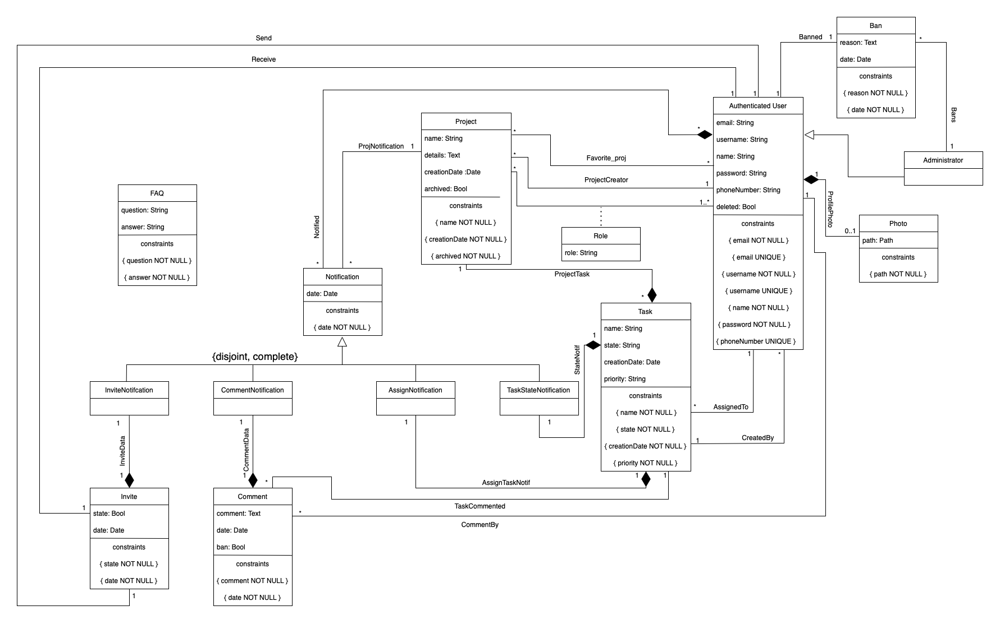

# EBD: Database Specification Component

## A4: Conceptual Data Model

> The Conceptual Domain Model contains the identification and description of the entities of the domain and the relationships between them in a UML class diagram.
>
> The diagram represents the main entities, the relationships between them, attributes, and the multiplicity of each relationship for the **Workfluido** website.

### 1. Class diagram

**Figure 1:** UML diagram

### 2. Additional Business Rules

* An administrator cannot ban another administrator.
* An administrator cannot ban someone who was already banned.
* An authenticated user cannot ban or unban someone.
* An administrator cannot create a project.
* Only a collaborator of a project can comment a task of that project.
* A coordinator cannot delete his account.
* Cannot invite an user that's already on the team.
* Project creator cannot be updated.
* Invite sender needs to be a collaborator of the project.
* A notification must have certain parameters NULL depending on the type.
* If someone invites an user, a notification is created.
* If someone comments a task, a notification is created to the assigned user.
* If a task is assigned to a user, a notification is created.
* If a task assigned to a user is updated to another user, a notification is created.
* A user must be belong to the project, to be assigend to a task.

***

---

## A5: Relational Schema, validation and schema refinement

### 1. Relational Schema


| Relation reference | Relation Compact Notation |
|--------------------|---------------------------|
| R01 | authenticated_user(**id_user**, email UK NN, username UK NN, name NN, password NN, phone_number, deleted, administrator) |
| R02 | photo(**id_photo**, path NN, id_user->authenticated_user NN) |
| R03 | project(**id_project**, name NN, details, creation_date NN, archived NN DF 'False', id_project_creator->authenticated_user) |
| R04 | task(**id_task**, name NN, state NN CK state IN task_state DF 'To do', details, creation_date NN, priority NN CK task_priority IN priority, id_user_assigned->authenticated_user,id_user_creator->authenticated_user NN, id_project->project NN) |
| R05 | notification(**id_notification**, date NN, type NN CK type IN notification_type, id_project->project NN, id_invite->invite, id_comment->comment, id_task->task, id_user->authenticated_user NN) |
| R06 | invite(**id_invite**, state NN CK state IN invite_state DF 'Received', date NN, id_project->project NN, id_user_sender->authenticated_user NN, id_user_receiver->authenticated_user NN) |
| R07 | comment(**id_comment**, comment NN, date NN, ban DF FALSE, id_task->task NN, id_user ->authenticated_user NN) |
| R08 | role(**id_user**->authenticated_user, **id_project**->project, role NN CK role IN user_role ) |
| R09 | faq(**id_faq**, question NN, answer NN) |
| R10 | ban(**id_ban**, reason NN, date NN, id_banned->authenticated_user NN, id_admin->authenticated_user NN) |
| R11 | favorite_proj(**id_user**->authenticated_user, **id_project**->project) |

Legend: UK = UNIQUE KEY, NN = NOT NULL, DF = DEFAULT, CK = CHECK

### 2. Domains

| Domain Name | Domain Specification |
|-------------|----------------------|
| task_state | ENUM ('To do', 'Doing','Done') |
| task_priority | ENUM ('High', 'Medium', 'Low') |
| user_role | ENUM ('Collaborator', 'Coordinator') |
| notification_type | ENUM ('Invite', 'Comment', 'Assign', 'TaskState') |
| invite_state | ENUM ('Received', 'Accepted', 'Rejected') |

### 3. Schema validation

| Table R01 (authenticated_users) |  |
|---------------------------------|--|
| **Keys:** { id_user }, { username }, { email }, { phone_number } |  |
| **Functional Dependencies** |  |
| FD0101 | { id_user } :- { name, username, email, password, phone_number, deleted } |
| FD0102 | { username } :- { name, id, email, password, phone_number, deleted } |
| FD0103 | { email } :- { name, username, id, password, phone_number, deleted } |
| FD0104 | { phone_number } :- { name, username, id, password, email, deleted } |
| **Normal Form** | BCNF |

| Table R02 (photo) |  |
|-------------------|--|
| **Keys:** { id_photo }, { id_user } |  |
| **Functional Dependencies** |  |
| FD0201 | { id_photo } :- { id_user, path } |
| FD0202 | { id_user } :- { id_photo, path } |
| **Normal Form** | BCNF |

| Table R03 (project) |  |
|---------------------|--|
| **Keys:** { id_project } |  |
| **Functional Dependencies** |  |
| FD0301 | { id_project } :- { name, details,creation_date,archived,id_creator } |
| **Normal Form** | BCNF |

| Table R04 (task) |  |
|------------------|--|
| **Keys:** { id_task } |  |
| **Functional Dependencies** |  |
| FD0401 | { id_task } :- { name, task_state,details,creation_date,task_priority,archived,id_project,id_user_creator,id_user_assigned } |
| **Normal Form** | BCNF |

| Table R05 (notification) |  |
|--------------------------|--|
| **Keys:** { id_notification } |  |
| **Functional Dependencies** |  |
| FD0501 | { id_notification } :- { date,notification_type,id_project,id_invite,id_comment,id_task } |
| **Normal Form** | BCNF |

| Table R06 (invite) |  |
|--------------------|--|
| **Keys:** { id_invite } |  |
| **Functional Dependencies** |  |
| FD0601 | { id_invite } :- { invite_state,date,id_user_sender,id_user_receiver } |
| **Normal Form** | BCNF |

| Table R07 (comment) |  |
|---------------------|--|
| **Keys:** { id_comment } |  |
| **Functional Dependencies** |  |
| FD0701 | { id_comment } :- { comment, ban, date, id_task, id_user } |
| **Normal Form** | BCNF |

| Table R08 (role) |  |
|------------------|--|
| **Keys:** { id_user, id_project } |  |
| **Functional Dependencies** |  |
| FD0801 | { id_user,id_project } :- { user_role } |
| **Normal Form** | BCNF |

| Table R09 (faq) |  |
|-----------------|--|
| **Keys:** { id_faq }, { question,answer } |  |
| **Functional Dependencies** |  |
| FD0901 | { id_faq } :- { question,answer } |
| FD0902 | { question,answer } :- { id_faq } |
| **Normal Form** | BCNF |

| Table R10 (ban) |  |
|-----------------|--|
| **Keys:** { id_ban }, { id_banned } |  |
| **Functional Dependencies** |  |
| FD1001 | { id_ban } :- {id_admin,id_banned,date,reason} |
| FD1002 | { id_banned } :- {id_ban, reason, date, id_admin, } |
| **Normal Form** | BCNF |

| Table R11 (favorite_proj) |  |
|---------------------------|--|
| **Keys:** { id_user,id_project } |  |
| **Functional Dependencies** |  |
| FD1201 | { id_user,id_project } :- {} |
| **Normal Form** | BCNF |


---

## A6: Indexes, triggers, transactions and database population

> <span dir="">This artefact contains the physical schema of the database, the identification and characterisation of the indexes, the support of data integrity rules with triggers and the definition of the database user-defined functions. This artefact also contains the complete database creation script, including indexes and triggers</span>

### 1. Database Workload

#### 1.1 Tuple Estimation

| **Relation reference** | **Relation Name** | **Order of magnitude** | **Estimated growth** |
|------------------------|-------------------|------------------------|----------------------|
| R01 | authenticated_user | 10k | 10/day |
| R02 | photo | 1k | 1/day |
| R03 | project | 1k | 10/day |
| R04 | task | 10k | 10/day |
| R05 | notification | 10k | 100/day |
| R06 | invite | 1k | 10/day |
| R07 | comment | 1k | 10/day |
| R08 | role | 10k | 1/day |
| R09 | faq | 10 | 1/mounth |
| R10 | ban | 100 | 10/mounth |
| R11 | favorite_proj | 1k | 10/week |

### 2. Proposed Indices

#### 2.1. Performance Indices

> Indices proposed to improve performance of the identified queries.

| **Index** | IDX01 |
|-----------|-------|
| **Relation** | task |
| **Attribute** | id_project |
| **Type** | hash |
| **Cardinality** | Medium |
| **Clustering** | No |
| **Justification** | Table 'task' is very large. Since this table is frequently accessed to obtain a project’s tasks, it is essential to use a performance index. As the task table is very dynamic, clustering is definitely not a good option. Furthermore, as there are several tasks for the same project, the cardinality is medium. Filtering is done by exact match, thus an hash type index would be best suited. |
| **SQL CODE** | CREATE INDEX project_tasks ON task USING hash (id_project); |

| **Index** | IDX02 |
|-----------|-------|
| **Relation** | notification |
| **Attribute** | id_user |
| **Type** | type |
| **Cardinality** | Medium |
| **Clustering** | No |
| **Justification** | Table 'notification' is very large. Since this table is frequently accessed to obtain user’s notifications, it is essential to use a performance index. As the task table is very dynamic, clustering is definitely not a good option. Furthermore, as there are several notifications for the same user, the cardinality is medium. Filtering is done by exact match, thus an hash type index would be best suited. |
| **SQL CODE** | CREATE INDEX user_notifications ON notification USING hash (id_user); |

| **Index** | IDX03 |
|-----------|-------|
| **Relation** | comment |
| **Attribute** | id_task |
| **Type** | Hash |
| **Cardinality** | Medium |
| **Clustering** | No |
| **Justification** | Table 'comment' is very large. Since this table is frequently accessed to obtain task’s comments, it is essential to use a performance index. As the task table is very dynamic, clustering is definitely not a good option. Furthermore, as there are several several comments for the same task, the cardinality is medium. Filtering is done by exact match, thus an hash type index would be best suited. |
| **SQL CODE** | CREATE INDEX task_comments ON comment USING hash (id_task); |

#### 2.2. Full-text Search Indices

> The system being developed must provide full-text search features supported by PostgreSQL. Thus, it is necessary to specify the fields where full-text search will be available and the associated setup, namely all necessary configurations, indexes definitions and other relevant details.

| **Index** | IDX04 |
|-----------|-------|
| **Relation** | project |
| **Attribute** | name,details |
| **Type** | GIN |
| **Clustering** | No |
| **Justification** | To provide full-text search features to look for projects based on their names. The index type is GIN because the indexed fields are not expected to change more than the times they are visited . |

**SQL CODE**

```sql
ALTER TABLE project
ADD COLUMN tsvectors TSVECTOR;

CREATE FUNCTION project_search_update() RETURNS TRIGGER AS 
$BODY$
BEGIN
    IF TG_OP = 'INSERT' THEN
            NEW.tsvectors = (
            setweight(to_tsvector('english', NEW.name), 'A')||
            setweight(to_tsvector('english', NEW.details), 'B') 
            );
    END IF;
    IF TG_OP = 'UPDATE' THEN
            IF (NEW.name <> OLD.name) THEN
                NEW.tsvectors = (
                    setweight(to_tsvector('english', NEW.name), 'A')||
                    setweight(to_tsvector('english', NEW.details), 'B') 
                );
            END IF;
    END IF;
    RETURN NEW;
END 
$BODY$
LANGUAGE plpgsql;

CREATE TRIGGER project_search_update
 BEFORE INSERT OR UPDATE ON project
 FOR EACH ROW
 EXECUTE PROCEDURE project_search_update();


CREATE INDEX project_search_idx ON project USING GIN (tsvectors);
```

| **Index** | IDX05 |
|-----------|-------|
| **Relation** | task |
| **Attribute** | name |
| **Type** | GIN |
| **Clustering** | Clustering of the index |
| **Justification** | To provide full-text search features to look for users based on their names. The index type is GIN because the indexed fields are not expected to change so much as the times they are visited . |

**SQL CODE**

```sql
ALTER TABLE task
ADD COLUMN tsvectors TSVECTOR;

CREATE FUNCTION task_search_update() RETURNS TRIGGER AS $BODY$
BEGIN
    IF TG_OP = 'INSERT' THEN
            NEW.tsvectors = (
            setweight(to_tsvector('english', NEW.name), 'A') 
            );
    END IF;
    IF TG_OP = 'UPDATE' THEN
            IF (NEW.name <> OLD.name) THEN
                NEW.tsvectors = (
                    setweight(to_tsvector('english', NEW.name), 'A') 
                );
            END IF;
    END IF;
    RETURN NEW;
END $BODY$
LANGUAGE plpgsql;

CREATE TRIGGER task_search_update
 BEFORE INSERT OR UPDATE ON task
 FOR EACH ROW
 EXECUTE PROCEDURE task_search_update();


CREATE INDEX task_search_idx ON task USING GIN (tsvectors);
```

### 3. Triggers

> User-defined functions and trigger procedures that add control structures to the SQL language or perform complex computations, are identified and described to be trusted by the database server. Every kind of function (SQL functions, Stored procedures, Trigger procedures) can take base types, composite types, or combinations of these as arguments (parameters). In addition, every kind of function can return a base type or a composite type. Functions can also be defined to return sets of base or composite values.

| **Trigger** | admin_ban_admin |
|-------------|-----------------|
| **Description** | An administrator cannot ban another administrator |

```sql
CREATE FUNCTION admin_ban_admin() RETURNS TRIGGER AS
$BODY$
BEGIN
    IF EXISTS (SELECT * FROM authenticated_user WHERE NEW.id_banned = id_user AND administrator) THEN
           RAISE EXCEPTION 'An administrador cannot ban another administrador.';
        END IF;
        RETURN NEW;
END
$BODY$
LANGUAGE plpgsql;

CREATE TRIGGER admin_ban_admin
        BEFORE INSERT OR UPDATE ON ban
        FOR EACH ROW
        EXECUTE PROCEDURE admin_ban_admin();    
```

| **Trigger** | ban_user_banned |
|-------------|-----------------|
| **Description** | An administrator cannot ban someone who was already banned |

```sql
CREATE FUNCTION ban_user_banned() RETURNS TRIGGER AS
$BODY$
BEGIN
    IF EXISTS (SELECT * FROM ban WHERE NEW.id_banned = id_banned) THEN
           RAISE EXCEPTION 'An administrador cannot ban an user that was already banned.';
        END IF;
        RETURN NEW;
END
$BODY$
LANGUAGE plpgsql;

CREATE TRIGGER ban_user_banned
        BEFORE INSERT OR UPDATE ON ban
        FOR EACH ROW
        EXECUTE PROCEDURE ban_user_banned();
```

| **Trigger** | user_ban_smo |
|-------------|--------------|
| **Description** | An authenticated user cannot ban or unban someone |

```sql
CREATE FUNCTION user_ban_smo() RETURNS TRIGGER AS
$BODY$
BEGIN
    IF EXISTS (SELECT * FROM authenticated_user WHERE NEW.id_admin = id_user AND administrator = False) THEN
           RAISE EXCEPTION 'An user cannot ban someone.';
        END IF;
        RETURN NEW;
END
$BODY$
LANGUAGE plpgsql;

CREATE TRIGGER user_ban_smo
        BEFORE INSERT OR UPDATE ON ban
        FOR EACH ROW
        EXECUTE PROCEDURE user_ban_smo(); 
```

| **Trigger** | admin_create_proj |
|-------------|-------------------|
| **Description** | An administrator cannot create a project |

```sql
    CREATE FUNCTION admin_create_proj() RETURNS TRIGGER AS
$BODY$
BEGIN
    IF EXISTS (SELECT * FROM authenticated_user WHERE (SELECT administrator FROM authenticated_user WHERE NEW.id_creator = id_user) = TRUE) THEN
           RAISE EXCEPTION 'An administrator cannot create a project.';
        END IF;
        RETURN NEW;
END
$BODY$
LANGUAGE plpgsql;

CREATE TRIGGER admin_create_proj
        BEFORE INSERT ON project
        FOR EACH ROW
        EXECUTE PROCEDURE admin_create_proj();
```

| **Trigger** | collaborator_comment_task |
|-------------|---------------------------|
| **Description** | Only a collaborator of a project can comment a task of that project |

```sql
CREATE FUNCTION comment_task() RETURNS TRIGGER AS
$BODY$
BEGIN
    IF NOT EXISTS(SELECT * FROM TASK INNER JOIN ROLE USING (id_project) WHERE (SELECT id_project FROM task WHERE NEW.id_task = id_task) = id_project AND NEW.id_user=id_user)
    THEN RAISE EXCEPTION 'A collaborator must be part of that task''s project to able to comment.';

    END IF;
    RETURN NEW;
END
$BODY$
LANGUAGE plpgsql;

CREATE TRIGGER comment_task
       BEFORE INSERT OR UPDATE ON comment
       FOR EACH ROW
       EXECUTE PROCEDURE comment_task();
```

| **Trigger** | coordinator_delete_acount |
|-------------|---------------------------|
| **Description** | A coordinator cannot delete his account |

```sql
   CREATE FUNCTION coordinator_delete_acount() RETURNS TRIGGER AS
    $BODY$
    BEGIN
    IF EXISTS (SELECT * FROM role WHERE NEW.id_user = id_user AND role.role = 'Coordinator') THEN
           RAISE EXCEPTION 'An coordinator cannot delete his account.';
        END IF;
        RETURN NEW;
    END
    $BODY$
    LANGUAGE plpgsql;

    CREATE TRIGGER coordinator_delete_acount
        BEFORE DELETE ON authenticated_user
        FOR EACH ROW
        EXECUTE PROCEDURE coordinator_delete_acount();
```

| **Trigger** | cannot_invite_collaborator |
|-------------|----------------------------|
| **Description** | Cannot invite an user that's already on the team |

```sql
CREATE FUNCTION cannot_invite_collaborator() RETURNS TRIGGER AS
$BODY$
BEGIN 
    IF EXISTS (SELECT * FROM role WHERE NEW.id_user_receiver = id_user AND NEW.id_project = id_project) THEN 
        RAISE EXCEPTION 'User already collaborator';
        END IF;
        RETURN NEW;
END
$BODY$
LANGUAGE plpgsql;

CREATE TRIGGER cannot_invite_collaborator
        BEFORE INSERT ON invite
        FOR EACH ROW
        EXECUTE PROCEDURE cannot_invite_collaborator(); 
```

| **Trigger** | update_project_creator |
|-------------|------------------------|
| **Description** | Project creator cannot be updated |

```sql
CREATE FUNCTION update_project_creator() RETURNS TRIGGER AS
$BODY$
BEGIN
    RAISE EXCEPTION 'The project creator cannot be updated.';
END
$BODY$
LANGUAGE plpgsql;

CREATE TRIGGER update_project_creator
        BEFORE UPDATE OF id_creator ON project
        FOR EACH ROW
        EXECUTE PROCEDURE update_project_creator();
```

| **Trigger** | invite_sender |
|-------------|---------------|
| **Description** | Invite sender needs to be a collaborator of the project |

```sql
CREATE FUNCTION invite_sender() RETURNS TRIGGER AS
$BODY$
BEGIN
    IF NOT EXISTS (SELECT * FROM role WHERE NEW.id_user_sender = id_user AND NEW.id_project = id_project) THEN
        RAISE EXCEPTION 'Invite sender not a collaborator';
    END IF;
    RETURN NEW;
END
$BODY$
LANGUAGE plpgsql;

CREATE TRIGGER invite_sender
        BEFORE INSERT ON invite
        FOR EACH ROW
        EXECUTE PROCEDURE invite_sender();
```

| **Trigger** | check_notification_type |
|-------------|-------------------------|
| **Description** | A notification must have certain parameters NULL depending on the type |

```sql
CREATE FUNCTION check_notification_type() RETURNS TRIGGER AS
$BODY$
BEGIN
    IF (NEW.type = 'Invite' AND (NEW.id_invite IS NULL OR NEW.id_comment IS NOT NULL OR NEW.id_task IS NOT NULL)) THEN
        RAISE EXCEPTION 'Notification invite type wrong';
    END IF;
    IF (NEW.type = 'Comment' AND (NEW.id_comment IS NULL OR NEW.id_task IS NOT NULL OR NEW.id_invite IS NOT NULL)) THEN
        RAISE EXCEPTION 'Notification comment type wrong';
    END IF;
    IF  ((NEW.type = 'Assign' OR NEW.type = 'TaskState') AND (NEW.id_task IS NULL OR NEW.id_comment IS NOT NULL OR NEW.id_invite IS NOT NULL)) THEN
        RAISE EXCEPTION 'Notification task type wrong';
    END IF;
    RETURN NEW;
END
$BODY$
LANGUAGE plpgsql;

CREATE TRIGGER check_notification_type
        BEFORE INSERT ON notification
        FOR EACH ROW
        EXECUTE PROCEDURE check_notification_type();
```

| **Trigger** | invite_notification |
|-------------|---------------------|
| **Description** | If someone invites an user, a notification is created |

```sql
CREATE FUNCTION invite_notification() RETURNS TRIGGER AS
$BODY$
BEGIN
    INSERT INTO notification (date, type,id_project,id_invite,id_comment,id_task,id_user) VALUES (CURRENT_DATE, 
        'Invite',NEW.id_project, NEW.id_invite,NULL,NULL,NEW.id_user_receiver);
    RETURN NEW;
END
$BODY$
LANGUAGE plpgsql;

CREATE TRIGGER invite_notification
        AFTER INSERT ON invite
        FOR EACH ROW
        EXECUTE PROCEDURE invite_notification();
```

| **Trigger** | comment_notification |
|-------------|----------------------|
| **Description** | If someone comments a task, a notification is created to the assigned user |

```sql
CREATE FUNCTION invite_sender() RETURNS TRIGGER AS
$BODY$
CREATE FUNCTION comment_notification() RETURNS TRIGGER AS
$BODY$
BEGIN
    INSERT INTO notification (date, type,id_project,id_invite,id_comment,id_task,id_user) VALUES ( CURRENT_DATE, 
        'Comment',(SELECT id_project FROM task WHERE id_task = NEW.id_task), NULL,NEW.id_comment,NULL,(SELECT id_user_assigned FROM task WHERE id_task = NEW.id_task));
    RETURN NEW;
END
$BODY$
LANGUAGE plpgsql;

CREATE TRIGGER comment_notification
        AFTER INSERT ON comment
        FOR EACH ROW
        EXECUTE PROCEDURE comment_notification();
```

| **Trigger** | task_assign_notification |
|-------------|--------------------------|
| **Description** | If a task is assigned to a user, a notification is created |

```sql
CREATE FUNCTION task_assign_notification() RETURNS TRIGGER AS
$BODY$
BEGIN
    INSERT INTO notification (date, type,id_project,id_invite,id_comment,id_task,id_user) VALUES ( CURRENT_DATE,'Assign',NEW.id_project, NULL,NULL,NEW.id_task,New.id_user_assigned);

    RETURN NEW;
END
$BODY$
LANGUAGE plpgsql;

CREATE TRIGGER task_assign_notification
        AFTER INSERT ON task
        FOR EACH ROW
        EXECUTE PROCEDURE task_assign_notification();
```

| **Trigger** | task_assign_update_notification |
|-------------|---------------------------------|
| **Description** | If a task assigned to a user is updated to another user, a notification is created |

```sql
CREATE FUNCTION task_assign_update_notification() RETURNS TRIGGER AS
$BODY$
BEGIN
    INSERT INTO notification (date, type,id_project,id_invite,id_comment,id_task,id_user) VALUES ( CURRENT_DATE,'Assign',NEW.id_project, NULL,NULL,NEW.id_task,New.id_user_assigned);

    RETURN NEW;
END
$BODY$
LANGUAGE plpgsql;

CREATE TRIGGER task_assign_update_notification
        AFTER UPDATE OF id_user_assigned ON task
        FOR EACH ROW
        EXECUTE PROCEDURE task_assign_update_notification();
```

| **Trigger** | assign_task |
|-------------|-------------|
| **Description** | A user must be belong to the project, to be assigend to a task |

```sql
CREATE FUNCTION assign_task() RETURNS TRIGGER AS
$BODY$
BEGIN
    IF NOT EXISTS (SELECT * FROM role WHERE NEW.id_user_assigned = id_user AND NEW.id_project = id_project) THEN
        RAISE EXCEPTION 'User assigned not in the project';
    END IF;
    RETURN NEW;
END
$BODY$
LANGUAGE plpgsql;

CREATE TRIGGER assign_task
        AFTER UPDATE OF id_user_assigned ON task
        FOR EACH ROW
        EXECUTE PROCEDURE assign_task();
```

### 4. Transactions

| SQL Reference | delete_user |
|---------------|------------------|
| Justification | When an user account is deleted, to preserve the tasks and comments made by that user, only his personal information is deleted so that the integrity of the database is garanteed |
| Isolation level | Serializable | |

``` sql
BEGIN TRANSACTION;

SET TRANSACTION ISOLATION LEVEL SERIALIZABLE;

UPDATE authenticated_user SET email = concat('anon',$id_user::int8,'@anon.com') WHERE id_user = $id_user;

UPDATE authenticated_user SET username = concat('anon',$id_user::int8) WHERE id_user = $id_user;

UPDATE authenticated_user SET name = 'anon' WHERE id_user = $id_user;

UPDATE authenticated_user SET password = concat('anon',4::int8) WHERE id_user = $id_user;

UPDATE authenticated_user SET phone_number = '' WHERE id_user = $id_user;

UPDATE authenticated_user SET deleted = True WHERE id_user = $id_user;

END TRANSACTION; 
```

## Annex A. SQL Code

[create.sql](https://git.fe.up.pt/lbaw/lbaw2223/lbaw2281/-/blob/main/create.sql) <br>
[populate.sql](https://git.fe.up.pt/lbaw/lbaw2223/lbaw2281/-/blob/main/populate.sql)

### A.1. Database schema

```sql
DROP TABLE IF EXISTS task CASCADE;
DROP TABLE IF EXISTS photo CASCADE;
DROP TABLE IF EXISTS project CASCADE;
DROP TABLE IF EXISTS invite CASCADE;
DROP TABLE IF EXISTS comment CASCADE;
DROP TABLE IF EXISTS notification CASCADE;
DROP TABLE IF EXISTS role CASCADE;
DROP TABLE IF EXISTS faq CASCADE;
DROP TABLE IF EXISTS ban CASCADE;
DROP TABLE IF EXISTS favorite_proj CASCADE;
DROP TABLE IF EXISTS authenticated_user CASCADE;

DROP TYPE IF EXISTS task_state;
DROP TYPE IF EXISTS task_priority;
DROP TYPE IF EXISTS user_role;
DROP TYPE IF EXISTS notification_type;
DROP TYPE IF EXISTS invite_state;

DROP FUNCTION IF EXISTS admin_ban_admin;
DROP FUNCTION IF EXISTS ban_user_banned;
DROP FUNCTION IF EXISTS user_ban_smo;
DROP FUNCTION IF EXISTS admin_create_proj;
DROP FUNCTION IF EXISTS comment_task;
DROP FUNCTION IF EXISTS coordinator_delete_acount;
DROP FUNCTION IF EXISTS cannot_invite_collaborator;
DROP FUNCTION IF EXISTS update_project_creator;
DROP FUNCTION IF EXISTS invite_sender;
DROP FUNCTION IF EXISTS check_notification_type;
DROP FUNCTION IF EXISTS invite_notification;
DROP FUNCTION IF EXISTS comment_notification;
DROP FUNCTION IF EXISTS task_assign_notification;
DROP FUNCTION IF EXISTS task_assign_update_notification;
DROP FUNCTION IF EXISTS assign_task;
DROP FUNCTION IF EXISTS project_search_update;
DROP FUNCTION IF EXISTS task_search_update;


CREATE TYPE task_state AS ENUM ('To Do','Doing','Done');
CREATE TYPE task_priority AS ENUM ('High', 'Medium', 'Low');
CREATE TYPE user_role AS ENUM ('Collaborator', 'Coordinator');
CREATE TYPE notification_type AS ENUM ('Invite', 'Comment', 'Assign', 'TaskState');
CREATE TYPE invite_state AS ENUM ('Received', 'Accepted', 'Rejected');


-----------------------------------------
-- Tables
-----------------------------------------
-- Table1: authenticated_user

CREATE TABLE authenticated_user (
    id_user SERIAL PRIMARY KEY,
    email TEXT NOT NULL UNIQUE,
    username VARCHAR(20) NOT NULL UNIQUE,
    name VARCHAR(255) NOT NULL,
    password VARCHAR(255) NOT NULL,
    phone_number VARCHAR(15),
    deleted BOOL DEFAULT FALSE,
    administrator BOOL DEFAULT FALSE
);

-- Table2: photo

CREATE TABLE photo (
    id_photo SERIAL PRIMARY KEY,
    path VARCHAR(255) NOT NULL,
    id_user INTEGER NOT NULL REFERENCES authenticated_user(id_user)
);

-- Table3: project


CREATE TABLE project (
    id_project SERIAL PRIMARY KEY,
    name VARCHAR(255) NOT NULL,
    details TEXT,
    creation_date DATE NOT NULL,
    archived BOOL NOT NULL DEFAULT FALSE,
    id_creator INTEGER NOT NULL REFERENCES authenticated_user(id_user)
);

-- Table4: task


CREATE TABLE task (
    id_task SERIAL PRIMARY KEY,
    name VARCHAR(255) NOT NULL,
    state task_state NOT NULL,
    details TEXT,
    creation_date DATE NOT NULL,
    priority task_priority NOT NULL,
    id_project INTEGER NOT NULL REFERENCES project(id_project),
    id_user_creator INTEGER NOT NULL REFERENCES authenticated_user(id_user),
    id_user_assigned INTEGER REFERENCES authenticated_user(id_user)
);

-- Table6: invite


CREATE TABLE invite (
    id_invite SERIAL PRIMARY KEY,
    state invite_state NOT NULL,
    date DATE NOT NULL,
    id_project INTEGER NOT NULL REFERENCES project(id_project) ,
    id_user_sender INTEGER NOT NULL REFERENCES authenticated_user(id_user) ,
    id_user_receiver INTEGER NOT NULL REFERENCES authenticated_user(id_user)
);

-- Table7: comment


CREATE TABLE comment (
    id_comment SERIAL PRIMARY KEY,
    comment TEXT NOT NULL,
    ban BOOL DEFAULT FALSE,
    date DATE NOT NULL,
    id_task INTEGER NOT NULL REFERENCES task(id_task),
    id_user INTEGER NOT NULL REFERENCES authenticated_user(id_user)
);

-- Table5: notification


CREATE TABLE notification (
    id_notification SERIAL PRIMARY KEY,
    date DATE NOT NULL,
    type notification_type NOT NULL,
    id_project INTEGER NOT NULL REFERENCES project(id_project),
    id_invite INTEGER REFERENCES invite(id_invite),
    id_comment INTEGER REFERENCES comment(id_comment),
    id_task INTEGER REFERENCES task(id_task),
    id_user INTEGER NOT NULL REFERENCES authenticated_user(id_user)
);


-- Table8: user_role


CREATE TABLE role (
    role user_role  NOT NULL ,
    id_user INTEGER REFERENCES authenticated_user(id_user),
    id_project INTEGER REFERENCES project(id_project),
    PRIMARY KEY (id_user, id_project)
);

-- Table9: faq


CREATE TABLE faq (
    id_faq SERIAL PRIMARY KEY,
    question TEXT NOT NULL,
    answer TEXT NOT NULL
);

-- Table10: ban


CREATE TABLE ban (
    id_ban SERIAL PRIMARY KEY,
    reason TEXT NOT NULL,
    date DATE NOT NULL,
    id_banned INTEGER NOT NULL REFERENCES authenticated_user(id_user),
    id_admin INTEGER NOT NULL REFERENCES authenticated_user(id_user)
);


-- Table12: favorite_proj


CREATE TABLE favorite_proj (
    id_user INTEGER REFERENCES authenticated_user(id_user),
    id_project INTEGER REFERENCES project(id_project),
    PRIMARY KEY (id_user, id_project)
);

---------------------------------------------------------------------------------
--Indexes

CREATE INDEX project_tasks ON task USING hash (id_project);
CREATE INDEX user_notifications ON notification USING hash (id_user);
CREATE INDEX task_comments ON comment USING hash (id_task);

ALTER TABLE project
ADD COLUMN tsvectors TSVECTOR;

CREATE FUNCTION project_search_update() RETURNS TRIGGER AS 
$BODY$
BEGIN
    IF TG_OP = 'INSERT' THEN
            NEW.tsvectors = (
            setweight(to_tsvector('english', NEW.name), 'A')||
            setweight(to_tsvector('english', NEW.details), 'B') 
            );
    END IF;
    IF TG_OP = 'UPDATE' THEN
            IF (NEW.name <> OLD.name) THEN
                NEW.tsvectors = (
                    setweight(to_tsvector('english', NEW.name), 'A')||
                    setweight(to_tsvector('english', NEW.details), 'B') 
                );
            END IF;
    END IF;
    RETURN NEW;
END 
$BODY$
LANGUAGE plpgsql;

CREATE TRIGGER project_search_update
 BEFORE INSERT OR UPDATE ON project
 FOR EACH ROW
 EXECUTE PROCEDURE project_search_update();


CREATE INDEX project_search_idx ON project USING GIN (tsvectors);

ALTER TABLE task
ADD COLUMN tsvectors TSVECTOR;

CREATE FUNCTION task_search_update() RETURNS TRIGGER AS $BODY$
BEGIN
    IF TG_OP = 'INSERT' THEN
            NEW.tsvectors = (
            setweight(to_tsvector('english', NEW.name), 'A') 
            );
    END IF;
    IF TG_OP = 'UPDATE' THEN
            IF (NEW.name <> OLD.name) THEN
                NEW.tsvectors = (
                    setweight(to_tsvector('english', NEW.name), 'A') 
                );
            END IF;
    END IF;
    RETURN NEW;
END $BODY$
LANGUAGE plpgsql;

CREATE TRIGGER task_search_update
 BEFORE INSERT OR UPDATE ON task
 FOR EACH ROW
 EXECUTE PROCEDURE task_search_update();


CREATE INDEX task_search_idx ON task USING GIN (tsvectors);


----------------------------------------------------------------------------------
--TRIGGERS

-- TRIGGER01
CREATE FUNCTION admin_ban_admin() RETURNS TRIGGER AS
$BODY$
BEGIN
    IF EXISTS (SELECT * FROM authenticated_user WHERE NEW.id_banned = id_user AND administrator) THEN
           RAISE EXCEPTION 'An administrador cannot ban another administrador.';
        END IF;
        RETURN NEW;
END
$BODY$
LANGUAGE plpgsql;

CREATE TRIGGER admin_ban_admin
        BEFORE INSERT OR UPDATE ON ban
        FOR EACH ROW
        EXECUTE PROCEDURE admin_ban_admin();

--------------------------------------------------------------------
--TRIGGER02
CREATE FUNCTION ban_user_banned() RETURNS TRIGGER AS
$BODY$
BEGIN
    IF EXISTS (SELECT * FROM ban WHERE NEW.id_banned = id_banned) THEN
           RAISE EXCEPTION 'An administrador cannot ban an user that was already banned.';
        END IF;
        RETURN NEW;
END
$BODY$
LANGUAGE plpgsql;

CREATE TRIGGER ban_user_banned
        BEFORE INSERT OR UPDATE ON ban
        FOR EACH ROW
        EXECUTE PROCEDURE ban_user_banned();

-----------------------------------------------------------
--TRIGGER03
CREATE FUNCTION user_ban_smo() RETURNS TRIGGER AS
$BODY$
BEGIN
    IF EXISTS (SELECT * FROM authenticated_user WHERE NEW.id_admin = id_user AND administrator = False) THEN
           RAISE EXCEPTION 'An user cannot ban someone.';
        END IF;
        RETURN NEW;
END
$BODY$
LANGUAGE plpgsql;

CREATE TRIGGER user_ban_smo
        BEFORE INSERT OR UPDATE ON ban
        FOR EACH ROW
        EXECUTE PROCEDURE user_ban_smo(); 

----------------------------------------------------------------------
--TRIGGER04
CREATE FUNCTION admin_create_proj() RETURNS TRIGGER AS
$BODY$
BEGIN
    IF EXISTS (SELECT * FROM authenticated_user WHERE (SELECT administrator FROM authenticated_user WHERE NEW.id_creator = id_user) = TRUE) THEN
           RAISE EXCEPTION 'An administrator cannot create a project.';
        END IF;
        RETURN NEW;
END
$BODY$
LANGUAGE plpgsql;

CREATE TRIGGER admin_create_proj
        BEFORE INSERT ON project
        FOR EACH ROW
        EXECUTE PROCEDURE admin_create_proj();

----------------------------------------------------------------
--TRIGGER05
CREATE FUNCTION comment_task() RETURNS TRIGGER AS
$BODY$
BEGIN
    IF NOT EXISTS(SELECT * FROM TASK INNER JOIN ROLE USING (id_project) WHERE (SELECT id_project FROM task WHERE NEW.id_task = id_task) = id_project AND NEW.id_user=id_user)
    THEN RAISE EXCEPTION 'A collaborator must be part of that task''s project to able to comment.';

    END IF;
    RETURN NEW;
END
$BODY$
LANGUAGE plpgsql;

CREATE TRIGGER comment_task
       BEFORE INSERT OR UPDATE ON comment
       FOR EACH ROW
       EXECUTE PROCEDURE comment_task();

----------------------------------------------------------
--TRIGGER06       
CREATE FUNCTION coordinator_delete_acount() RETURNS TRIGGER AS
    $BODY$
    BEGIN
    IF EXISTS (SELECT * FROM role WHERE NEW.id_user = id_user AND role.role = 'Coordinator') THEN
           RAISE EXCEPTION 'An coordinator cannot delete his account.';
        END IF;
        RETURN NEW;
    END
    $BODY$
    LANGUAGE plpgsql;

    CREATE TRIGGER coordinator_delete_acount
        BEFORE DELETE ON authenticated_user
        FOR EACH ROW
        EXECUTE PROCEDURE coordinator_delete_acount();

-----------------------------------------------------------
--TRIGGER07
CREATE FUNCTION cannot_invite_collaborator() RETURNS TRIGGER AS
$BODY$
BEGIN 
    IF EXISTS (SELECT * FROM role WHERE NEW.id_user_receiver = id_user AND NEW.id_project = id_project) THEN 
        RAISE EXCEPTION 'User already collaborator';
        END IF;
        RETURN NEW;
END
$BODY$
LANGUAGE plpgsql;

CREATE TRIGGER cannot_invite_collaborator
        BEFORE INSERT ON invite
        FOR EACH ROW
        EXECUTE PROCEDURE cannot_invite_collaborator();

------------------------------------------------------------
--TRIGGER08
CREATE FUNCTION update_project_creator() RETURNS TRIGGER AS
$BODY$
BEGIN
    RAISE EXCEPTION 'The project creator cannot be updated.';
END
$BODY$
LANGUAGE plpgsql;

CREATE TRIGGER update_project_creator
        BEFORE UPDATE OF id_creator ON project
        FOR EACH ROW
        EXECUTE PROCEDURE update_project_creator();

---------------------------------------------------------------------------------
--TRIGGER09
CREATE FUNCTION invite_sender() RETURNS TRIGGER AS
$BODY$
BEGIN
    IF NOT EXISTS (SELECT * FROM role WHERE NEW.id_user_sender = id_user AND NEW.id_project = id_project) THEN
        RAISE EXCEPTION 'Invite sender not a collaborator';
    END IF;
    RETURN NEW;
END
$BODY$
LANGUAGE plpgsql;

CREATE TRIGGER invite_sender
        BEFORE INSERT ON invite
        FOR EACH ROW
        EXECUTE PROCEDURE invite_sender();

-----------------------------------------------------------------------------------
--TRIGGER10
CREATE FUNCTION check_notification_type() RETURNS TRIGGER AS
$BODY$
BEGIN
    IF (NEW.type = 'Invite' AND (NEW.id_invite IS NULL OR NEW.id_comment IS NOT NULL OR NEW.id_task IS NOT NULL)) THEN
        RAISE EXCEPTION 'Notification invite type wrong';
    END IF;
    IF (NEW.type = 'Comment' AND (NEW.id_comment IS NULL OR NEW.id_task IS NOT NULL OR NEW.id_invite IS NOT NULL)) THEN
        RAISE EXCEPTION 'Notification comment type wrong';
    END IF;
    IF  ((NEW.type = 'Assign' OR NEW.type = 'TaskState') AND (NEW.id_task IS NULL OR NEW.id_comment IS NOT NULL OR NEW.id_invite IS NOT NULL)) THEN
        RAISE EXCEPTION 'Notification task type wrong';
    END IF;
    RETURN NEW;
END
$BODY$
LANGUAGE plpgsql;

CREATE TRIGGER check_notification_type
        BEFORE INSERT ON notification
        FOR EACH ROW
        EXECUTE PROCEDURE check_notification_type();

-------------------------------------------------------------------------------------
--TRIGGER11
CREATE FUNCTION invite_notification() RETURNS TRIGGER AS
$BODY$
BEGIN
    INSERT INTO notification (date, type,id_project,id_invite,id_comment,id_task,id_user) VALUES (CURRENT_DATE, 
        'Invite',NEW.id_project, NEW.id_invite,NULL,NULL,NEW.id_user_receiver);
    RETURN NEW;
END
$BODY$
LANGUAGE plpgsql;

CREATE TRIGGER invite_notification
        AFTER INSERT ON invite
        FOR EACH ROW
        EXECUTE PROCEDURE invite_notification();

------------------------------------------------------------------------------------
--TRIGGER12
CREATE FUNCTION comment_notification() RETURNS TRIGGER AS
$BODY$
BEGIN
    INSERT INTO notification (date, type,id_project,id_invite,id_comment,id_task,id_user) VALUES ( CURRENT_DATE, 
        'Comment',(SELECT id_project FROM task WHERE id_task = NEW.id_task), NULL,NEW.id_comment,NULL,(SELECT id_user_assigned FROM task WHERE id_task = NEW.id_task));
    RETURN NEW;
END
$BODY$
LANGUAGE plpgsql;

CREATE TRIGGER comment_notification
        AFTER INSERT ON comment
        FOR EACH ROW
        EXECUTE PROCEDURE comment_notification();

-----------------------------------------------------------------------------------
--TRIGGER13
CREATE FUNCTION task_assign_notification() RETURNS TRIGGER AS
$BODY$
BEGIN
    INSERT INTO notification (date, type,id_project,id_invite,id_comment,id_task,id_user) VALUES ( CURRENT_DATE,'Assign',NEW.id_project, NULL,NULL,NEW.id_task,New.id_user_assigned);

    RETURN NEW;
END
$BODY$
LANGUAGE plpgsql;

CREATE TRIGGER task_assign_notification
        AFTER INSERT ON task
        FOR EACH ROW
        EXECUTE PROCEDURE task_assign_notification();

------------------------------------------------------------------------------------
--TRIGGER14
CREATE FUNCTION task_assign_update_notification() RETURNS TRIGGER AS
$BODY$
BEGIN
    INSERT INTO notification (date, type,id_project,id_invite,id_comment,id_task,id_user) VALUES ( CURRENT_DATE,'Assign',NEW.id_project, NULL,NULL,NEW.id_task,New.id_user_assigned);

    RETURN NEW;
END
$BODY$
LANGUAGE plpgsql;

CREATE TRIGGER task_assign_update_notification
        AFTER UPDATE OF id_user_assigned ON task
        FOR EACH ROW
        EXECUTE PROCEDURE task_assign_update_notification();

-------------------------------------------------------------------------------------
--TRIGGER15
CREATE FUNCTION assign_task() RETURNS TRIGGER AS
$BODY$
BEGIN
    IF NOT EXISTS (SELECT * FROM role WHERE NEW.id_user_assigned = id_user AND NEW.id_project = id_project) THEN
        RAISE EXCEPTION 'User assigned not in the project';
    END IF;
    RETURN NEW;
END
$BODY$
LANGUAGE plpgsql;

CREATE TRIGGER assign_task
        AFTER UPDATE OF id_user_assigned ON task
        FOR EACH ROW
        EXECUTE PROCEDURE assign_task();
```

### A.2. Database population

```sql
INSERT INTO authenticated_user (email, username, name, password, phone_number) VALUES ('joaoaraujo@gmail.com', 'joaoaraujo76', 'João Araújo', '1234', '934212314');
 INSERT INTO authenticated_user (email, username, name, password, phone_number) VALUES ('liavieira@gmail.com', 'liavieira02', 'Lia Vieira', '1234', '934772314'); 
INSERT INTO authenticated_user (email, username, name, password, phone_number) VALUES ('joaomoreira@gmail.com', 'joaomoreira07', 'João Moreira','1234', '944212314');
 INSERT INTO authenticated_user (email, username, name, password, phone_number) VALUES ('hugogomes@gmail.com', 'hugogomes82', 'Hugo Gomes', '1234', '934211114'); 
INSERT INTO authenticated_user (email, username, name, password, phone_number) VALUES ('diogoneves@gmail.com', 'neves76', 'Diogo Neves', '1234', '934212314'); 
INSERT INTO authenticated_user (email, username, name, password, phone_number) VALUES ('tiagoaleixo@gmail.com', 'aleixo02', 'Tiago Aleixo', '1234', '934772314'); 
INSERT INTO authenticated_user (email, username, name, password, phone_number) VALUES ('diogobabo@gmail.com', 'diogo_babo07', 'Diogo Babo','1234', '944212314'); 
INSERT INTO authenticated_user (email, username, name, password, phone_number) VALUES ('tiagobranquinho@gmail.com', 'branquinho82', 'Tiago Branquinho', '1234', '934211114'); 
INSERT INTO authenticated_user (email, username, name, password, phone_number) VALUES ('alexandrecorreia@gmail.com', 'alex_correia76', 'Alexandre Correia', '1234', '934212314'); 
INSERT INTO authenticated_user (email, username, name, password, phone_number) VALUES ('henriquesilva@gmail.com', 'henriquesilva02', 'Henrique Silva', '1234', '934772314');
```
---

## Revision history

No changes were made to the first delivery

---

GROUP2281, 13/10/2022

* Hugo Gomes up202004343@fe.up.pt
* João Moreira up202005035@fe.up.pt
* João Araújo up202007855@fe.up.pt (Editor)
* Lia Vieira up202005042@fe.up.pt