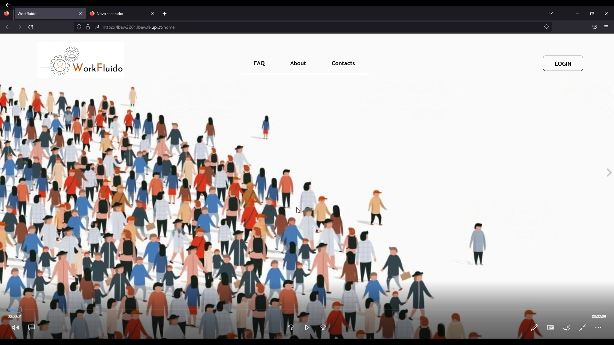

# PA: Product and Presentation

Workfluido is the new webplatform for project management, allowing every user to better guide their team and see what is already done and what is left to do.

## A9: Product

In a world where teamwork has become crucial to combat the constant adversities that have arisen such as remote work, the need for a project management tool has emerged. So, we decided to create Workfluido.

Workfluido is a web application to help teams plan and manage their projects in a simple and eficient way, making project management less of a chore.

Our target audience is companies from all sizes and areas but can be used by anyone who needs to manage a team project. It gives our users the ability to organize their workflow by forming teams, assigning tasks and discussing topics with their teams members.

There are four types of roles in workfluido: anonymous users, collaborators, coordinators and administrators. The anonymous users only have access to the welcome page where they are presented with a short description of our website and also able to log in or register themselves by e-mail or other platforms such as google or github.

A collaborator has its own profile with a picture and a brief description which can be edited when needed and can be viewed by any other collaborator. Each may be associated with multiple projects at the same time.

Our application allows any collaborator to create a new team and, by doing so automatically becomes a coordinator of that team. After teams are formed, it is possible to create tasks to be carried out by the team members and change their progression status.

The coordinator has more privileges than the other team members, such as assigning users to tasks, editing and deleting tasks assigned by others and adding new members to the team. He is also able to change tasks' due dates and their priority.

Each project has a team, task lists and also a discussion forum for members of the project. Each task can have comments made by other collaborators and it is possible to keep track of the user that defined the task as well as the one who completed it.

At any time, collaborators can view the task details and mark a project as favorite. Users also have the ability to search for specific projects, tasks and messages of the forum and view the list of all the projects that they have participated in, which can be seen in their profile only by them.

Finally, the administrators are the ones responsible for keeping a clean and safe website by administrating user accounts and their respective projects being able to view, change or even delete both of them.

### 1. Installation

The source code can be found [here](https://git.fe.up.pt/lbaw/lbaw2223/lbaw2281/-/tree/main)

To run the docker container you need to have FEUP's VPN on and run the following commands:

```docker
composer install

docker login git.fe.up.pt:5050

./upload_image.sh

docker run -it -p 8000:80 --name=lbaw2281 -e DB_DATABASE="lbaw2281" -e DB_SCHEMA="lbaw2281" -e DB_USERNAME="lbaw2281" -e DB_PASSWORD="PASSWORD" git.fe.up.pt:5050/lbaw/lbaw2223/lbaw2281
```

### 2. Usage

The link to the final product is: http://lbaw2281.lbaw.fe.up.pt

#### 2.1. Administration Credentials

First login as an admin and then enter the following [link](https://lbaw2281.lbaw.fe.up.pt/admin/dashboard)

| Username | Password |
|----------|----------|
| admin@gmail.com | 123456 |

#### 2.2. User Credentials

| Type | Username | Password |
|------|----------|----------|
| coordinator account | joaoaraujo@gmail.com | 123456 |
| collaborator account | joaomoreira@gmail.com | 123456 |

### 3. Application Help

For help, the user can enter the [FAQ page](https://lbaw2281.lbaw.fe.up.pt/faq) and there should find all the answers to the possible doubts that may encounter.

### 4. Input Validation

User input is validated both in the client-side and server-side. For client-side, for example, when updating the phone number in the profile, the number must start with '91', '92, '93' or '96' since these are the starting number of a portuguesa number. For server-side, an example of it is when updating the profile, in order to update the password, the old password must match the one stored in the database.

### 5. Check Accessibility and Usability

The checklist of accessibility and usability can be seen in the following links:

* [Accessibility](https://git.fe.up.pt/lbaw/lbaw2223/lbaw2281/-/blob/main/Checklist_Acessibilidade.pdf)
* [Usability](https://git.fe.up.pt/lbaw/lbaw2223/lbaw2281/-/blob/main/Checklist_Usabilidade.pdf)

### 6. HTML & CSS Validation

The results of the validation of the css and html can be seen in the following links:

* [css](https://git.fe.up.pt/lbaw/lbaw2223/lbaw2281/-/blob/main/Css_validation.pdf)
* [html](https://git.fe.up.pt/lbaw/lbaw2223/lbaw2281/-/blob/main/HTML_validation.pdf)

### 7. Revisions to the Project

The only revisions made to the project since the requirements specification stage where during the eap stage:

1. Changed priority of 'US15:View Personal Notifications' to high.
2. Changed priority of 'US33:Administrate User Accounts' to medium.
3. Changed priority of 'US34:Browse project' to medium.
4. Changed priority of 'US35:View Project Details' to medium.
5. Changed priority of 'US36:Block and Unblock User Accounts' to medium.
6. Changed priority of 'US37:Delete User Accounts' to medium.
7. Changed priority of 'US:Add FAQ' to medium.

### 8. Implementation Details

#### 8.1. Libraries Used

[Boostrap](https://getbootstrap.com/) and [Laravel](https://laravel.com/) where the two main libraries used throughout the project. On top of that,[Popper](https://popper.js.org) was also used in order to implement the dropdown menus.

#### 8.2 User Stories

| US Identifier | Name | Module | Priority | Team Members | State |
|---------------|------|--------|----------|--------------|-------|
| US01 | Homepage | M04 | High/Mandatory | **Lia Silva**, Hugo Gomes | 100% |
| US05 | Sign In | M01 | High/Mandatory | **João Moreira**, Lia Silva | 100% |
| US06 | Sign Up | M01 | High/Mandatory | **João Moreira**, Lia Silva | 100% |
| US09 | Edit Profile | M01 | High/Mandatory | **Hugo Gomes**, João Moreira | 100% |
| US10 | Create Project | M02 | High/Mandatory | **João Moreira**, Lia Silva | 100% |
| US11 | Log out | M01 | High/Mandatory | **João Moreira**, Lia Silva | 100% |
| US12 | View Profile | M01 | High/Mandatory | **Hugo Gomes**, Lia Silva | 100% |
| US15 | View Personal Notifications | M02 | High/Mandatory | **João Moreira**, Lia Silva | 100% |
| US13 | Accept Team Invitations | M02 | High/Mandatory | **Lia Silva**, Hugo Gomes | 100% |
| US14 | View projects | M01 | High/Mandatory | **Hugo Gomes**, João Moreira | 100% |
| US18 | Mark Project as Favorite | M02 | Medium/Important | **João Moreira**, Lia Silva | 100% |
| US21 | Create Task | M03 | High/Mandatory | **João Moreira**, Hugo Gomes | 100% |
| US20 | Manage Tasks | M03 | High/Mandatory | **Lia Silva**, Hugo Gomes | 100% |
| US22 | View Task Details | M03 | High/Mandatory | **João Moreira**, Lia Silva, Hugo Gomes | 100% |
| US24 | Complete an Assigned Task | M03 | High/Mandatory | **Lia Silva**, Hugo Gomes | 100% |
| US25 | Comment on task | M03 | Medium/Important | **Hugo Gomes**, João Araújo | 100% |
| US16 | Delete Account | M01 | Medium/Important | **João Moreira**, Lia Silva | 100% |
| US23 | Search Tasks | M03 | High/Mandatory | **Lia Silva**, João Araújo | 100% |
| US28 | Add Users to Project | M02 | High/Mandatory | **João Moreira**, Hugo Gomes | 100% |
| US29 | Assign New Coordinator | M02 | High/Mandatory | **João Araújo**, Lia Silva | 100% |
| US35 | View Project Details | M02 | Medium/Important | **Hugo Gomes**, Lia Silva | 100% |
| US30 | Edit Project Details | M02 | High/Mandatory | **João Moreira**, Lia Silva | 100% |
| US19 | Leave Project | M02 | High/Mandatory | **João Moreira**, Hugo Gomes | 100% |
| US31 | Remove project member | M02 | High/Mandatory | **Lia Silva**, João Moreira | 100% |
| US26 | View project’s team and their profiles | M02 | Medium/Important | **Hugo Gomes**, Lia Silva, João Moreira | 100% |
| US32 | Archive Project | M02 | High/Mandatory | **Lia Silva** | 100% |
| US33 | Administrate User Accounts | M04 | Medium/Important | **João Araújo** | 100% |
| US07 | Recover Password | M01 | Medium/Important | **João Moreira** | 100% |
| US17 | Support Profile Picture | M01 | Medium/Important | **Hugo Gomes** | 100% |
| US34 | Browse project | M02 | Medium/Important | **João Moreira** | 100% |
| US36 | Block and Unblock User Accounts | M04 | Medium/Important | **João Araújo** | 100% |
| US02 | See About | M04 | Medium/Important | **João Araújo** | 100% |
| US03 | Consult contacts | M04 | Medium/Important | **João Araújo** | 100% |
| US04 | FAQ Page | M04 | Medium/Important | **João Araújo** | 100% |
| US37 | Delete User Accounts | M04 | Medium/Important | **João Araújo** | 100% |
| US38 | Add FAQ | M04 | Medium/Important | **João Araújo** | 100% |
| US08 | Sign In and Sign Up using external API | M01 | Low/Optional | - | 0% |
| US27 | Team Forum | M02 | Low/Optional | - | 0% |

---

## A10: Presentation

### 1. Product presentation

The purpose of this project is to develop and promote a system available through the web for the management of projects, either personal or professional.

Upon creating an account, the user can create a project as well as accept an invite to an existing one. Inside a project, it’s possible to create the necessary tasks, comment a task and even change its state and to who is assigned to it. On top of that it is possible to search for a task, user, or project by the search bar.

The link to the final product is the following: http://lbaw2281.lbaw.fe.up.pt

### 2. Video presentation



The video is available in the following [link](https://drive.google.com/drive/u/4/folders/1-fPoSR3lXyPI38UgpWf6iQBe2Lk_ckoT)

---

## Revision history

### Some changes have been made to the delivery of the A7.

* We changed the url of some routes that were already done.
* We also deleted some routes that were done, as we decided not to implement them, such as deleting comments.
* In addition, a single API capable of searching for projects, tasks and people was created. Previously we had two separate APIs.
* Added a new route to handle archiving projects.
* In addition, 2 routes were added both in case the user forgets the password. As well as effectively changing the password.
* We have also created a new route capable of uploading user profile photos.
* Furthermore, and finally, a get page was created to list all members of a project.
* The new changes can be found here: [Open API Specification File](https://git.fe.up.pt/lbaw/lbaw2223/lbaw2281/-/blob/main/a7_openapi.yaml)

GROUP2281, 03/01/2023

* Hugo Gomes up202004343@fe.up.pt (Editor)
* João Moreira up202005035@fe.up.pt
* João Araújo up202007855@fe.up.pt
* Lia Vieira up202005042@fe.up.pt